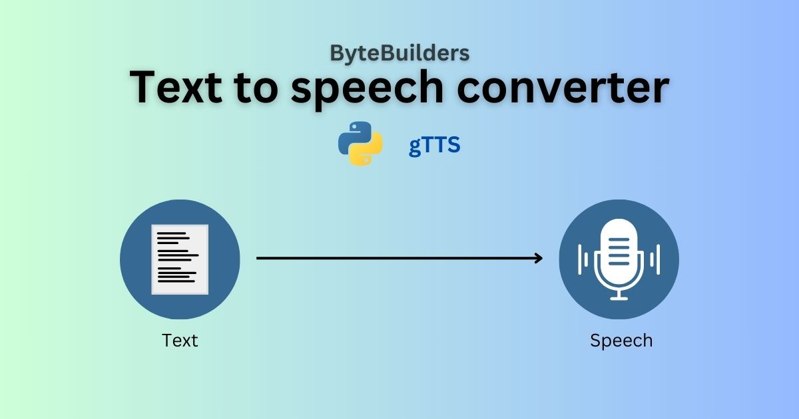

## Student Enroll System

This is a simple Python script that converts text from a file into speech using the Google Text-to-Speech (gTTS) library. The generated speech is saved as an audio file.


## Screenshots




### Prerequisites

Make sure you have Python installed on your system. You'll also need to install the gtts library. You can install it using pip:

```bash
  pip install gtts
```
### Usage/Examples

1. Place your text in a file named 'text.txt' in the same directory as the script.
2. Run the script to convert the text to speech and save it as an audio file.


### How it Works

1. The script opens and reads the content of 'text.txt'.
2. It uses the gTTS library to convert the text into speech.
3. The speech is saved as 'audio.wav'.
4. The audio file is played automatically using the system's default audio player.
### Customization

- **Language**: hange the language variable to convert text to speech in a different language. Check the gTTS documentation for supported languages.
- **Speed**: Set the 'slow' parameter to 'True' for slower speech.
