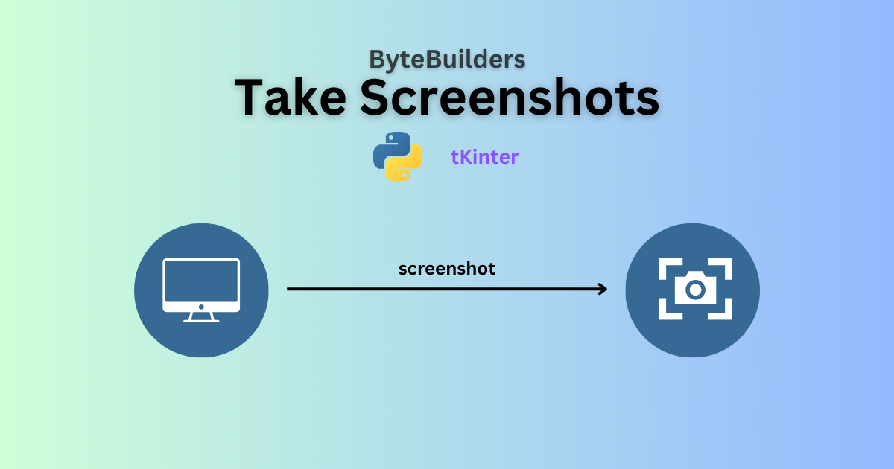

## Python Screenshot Tool

🚀 A simple Python tool for taking screenshots with a single click.

This Python script provides a GUI application for taking screenshots. When the "Take Screenshot" button is clicked, the application minimizes, takes a screenshot, saves it with a unique filename based on the current timestamp, and then restores the application window.


### Screenshots



### Requirements

- Python 3.x
- `pyautogui` library
- `tkinter` library (usually included with Python installations)

### Prerequisites

Install the required packages:

```bash
  pip install pyautogui
```
