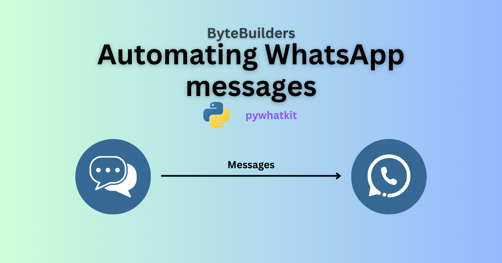

## WhatsApp Message Automation

This repository contains a Python script to automate sending WhatsApp messages using the `pywhatkit` library. The script allows you to send messages at a scheduled time or instantly.

### Screenshots



### Prerequisites

Before you begin, ensure you have met the following requirements:

- You have installed Python 3.x.
- You have a WhatsApp account and are logged into WhatsApp Web on your default browser.

Install the required packages:

```bash
  pip install pywhatkit
```

### Important Notes

- Phone Number Format: Ensure the phone number includes the country code.
- WhatsApp Web: Make sure you are logged in to WhatsApp Web on your default browser.
- Scheduled Time: The message is scheduled to be sent at the specified time (24-hour format).
